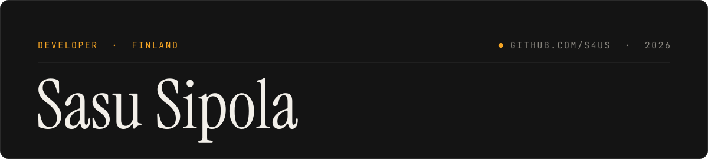

  

Hi, I'm Sasu, a developer from Finland 🇫🇮

---

## 🚀 Featured Projects

**[Roqer](https://github.com/S4US/Roqer)**: Open-source AI agent for Roblox Studio&nbsp;

 
Builds, scripts and playtests inside Roblox Studio using your own ChatGPT/Claude subscription or any compatible API. Models props in Blender, runs its own playtests, and ships its Studio tools as a standalone MCP server. TypeScript + Electron + Luau.

 

---

## 🛠️ Tech

